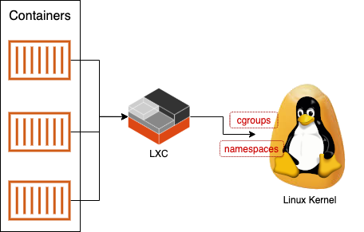
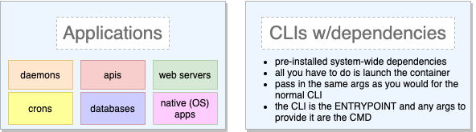
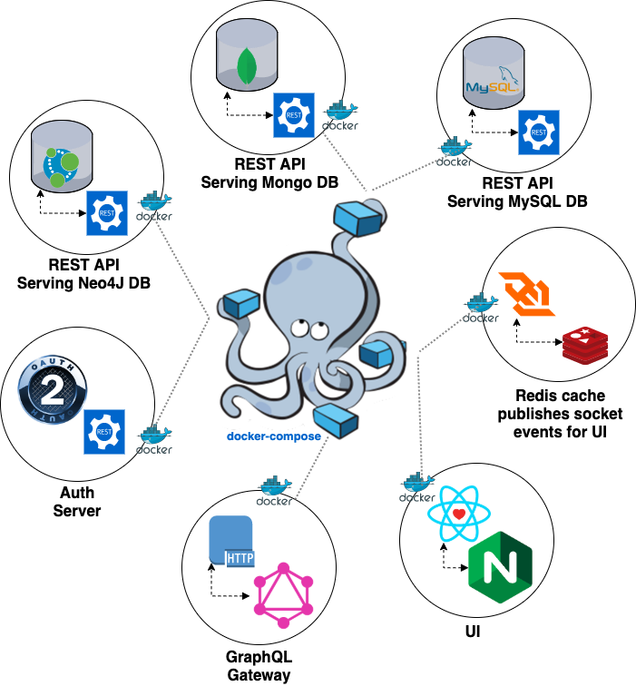

# Docker

## Linux cGroups, Namespaces and LXC

In 2007 an update to the Linux kernel brought us the raw tools for creating containers: [cgroups](https://en.wikipedia.org/wiki/Cgroups) and namespaces. These essentially allow you to isolate processes on a Linux machine so that they can each have resources (CPU, memory, etc.) allocated to them, yet not take down the entire machine.

They allow you to set limits and to keep isolated processes in their own sandbox. CGroups also allow you a measure of control _over_ the individual processes so that you can more easily shut down a rogue process (and rest assured that it can't break out and compromise other processes or attach the host kernel.

The following year, a natural evolution followed where CGroups could be used to virtualize the Linux operating system, but rather than virtualizing the Linux kernel, CGroups were used to share kernel resources safely.

Operating system virtualization had been around awhile already (in solutions like VMWare) but what this afforded you was a _much_ more efficient way to virtualize an OS where you could allocate resources to a virtualized "container" yet not virtualize the kernel.

This may sound at first like a problem, but cgroups and namespaces allow a rock solid way to keep each container in a tightly regulated partition and completely unable to "break out" and compromise the host machine or compromise another container. Namespaces keep a container from being able to see anything other than what is allocated to itself (ie, it can't inspect adjacent containers or details about the host OS). And if a rogue container attempts to exceed its resource limits, it is simply unable to do so, _and_ it can be configured to shut down when it tries.

This initial implementation of virtualized containers in the Linux OS is called [LXC](https://en.wikipedia.org/wiki/LXC) and it became (initially) the engine that drove Docker.



## A Docker Image vs a Container

A docker image is a recipe for a container. And just like a recipe for a dish you might create in the kitchen, you can make numerous instances of that dish from a single recipe. All the steps involved in the prcess are laid out in a (usually) ordered sequence, and if those steps are repeated in that order you can expect the same result.

The steps in a recipe for a docker container are spelled out in a `Dockerfile` and each line begins with a reserved keyword. Each line is intended to put the image into a specific state and each line after that one will bear the effect of the previous line. Docker actually creates a unique hash to represent the exact state that each line in a Dockerfile causes for the image.

The most common keywords you'll see at the beginning of each line in a `Dockerfile` are the following:

* `ARG` - processes and/or sets a build argument for the docker image (easiest way to feed in environment variables _outside_ the image so they'll be baked into _every_ container created from the image)
* `ENV` - processes and/or sets an environment variable (often this may be assigned a value received from an `ARG`)
* `RUN` - executes a command (ie, download a package, install a dependency)
* `COPY` - copies files from the host machine into the image
* `CMD` - The command that the docker _container_ will run when built from this image
* `ENTRYPOINT` - Optional (but common) and pairs well with `CMD`. You use this if you want to create an image such that several containers may pass in different arguments to the thing you dockerized. This value can be the command to launch your app/script in the docker container, and _then_ the container can _append_ commands to the entrypoint.



## Docker Compose

Docker Compose is a way to simplify and shorten (potentially) long Docker shell commands into simple YAML configuration files. You are still calling Docker under-the-hood but all the complexities of port mappings, environment variables, volume mounting, container naming, etc., are laid out in a more readable format that is much easier to debug when things go wrong.



Here is a snippet from a larger [example](https://github.com/arizonatribe/api-gateway/blob/master/docker-compose.yml) container configuration to demonstrate the syntax of a compose YAML file:

```yaml
version: "3.7"
services:
  students-api:
    image: students-api:latest
    container_name: students-api
    build:
      context: ./students-api
      dockerfile: ./docker/Dockerfile
    env_file:
      - ./students-api/.env
    volumes:
      - students-db-data:/data/db
    ports:
      - "6000:6000"

  students-ui:
    image: students-ui:latest
    container_name: students-ui
    depends_on:
      - students-api
    build:
      context: ./students-client
      dockerfile: ./docker/Dockerfile
    ports:
      - "3000:3000"

volumes:
  students-db-data:
```

To build all the images associated with that configuration file you would just run:

```
docker-compose build
```

and this is how you build & start the container you built from that image:

```
docker-compose up
```

(you can combine the two easily)

```
docker-compose up --build
```

## Some common docker commands

Multi-stage builds allow you to pull in all the NPM packages for an npm/yarn install but not put all those files in your production app. Essentially you segment your container into two halves by creating two FROM statements in the Dockerfile. Everything in the first section you can use to test, lint, build your bundle, and then the second FROM section will reach back into the first and COPY your bundled assets (but none of the node_modules). The running container will only be as big as what you put into the last FROM section, so that way you can keep a really light production container.


Here are some of the common commands you'll run from the shell when troubleshooting docker containers:

* `docker ps` - shows you all the running containers
* `docker stop <container_name>` - stops the container
* `docker ps -a` - shows you all containers (running or stopped)
* `docker images` - shows you all your docker images (from which containers are built) and any named <none> are essential orphaned or bad in some way and should be removed when you see them (as long as you remove the container(s) they reference first)
* `docker rm <container_name>` - removes a container
* `docker rmi <image_name>` - removes an image

here’s some bash aliases I’ve created over the years and I use them to streamline working with docker:

```
# Get names of all containers
alias docker-containers='docker ps -a | awk '"'"'{if(NR>1) print $NF}'"'"''
# Get ids of all containers
alias docker-container-ids='docker ps -a | awk '"'"'{print $1}'"'"''
# Get names of all images
alias docker-images='docker images | awk '"'"'{if(NR>1) print $1 ":" $2}'"'"''
# Remove all dangling docker images
alias docker-rmi='docker rmi $(docker images --filter "dangling=true" -q --no-trunc)' 
# Show dangling (orphaned) volumes
alias docker-volumes='docker volume ls -f dangling=true | grep -v VOLUME'
# Removes all dangling volumes
alias docker-rm-volumes='docker volume rm $(docker volume ls -f dangling=true | awk '"'"'{print $2}'"'"' | grep -v VOLUME)'
# Checks to see if transparent-huge-pages feature is enabled
```

## Resources

* [A new way to get started with Docker](https://www.docker.com/blog/a-new-way-to-get-started-with-docker/)
* [Getting Started With MongoDB As A Docker Container Deployment](https://www.thepolyglotdeveloper.com/2019/01/getting-started-mongodb-docker-container-deployment/)
* [Docker Hub](https://hub.docker.com/u/arizonatribe) - containers I've created over the years on this centralized open-source repository for docker
* [Example dockerized application with multiple APIs, a UI and databases](https://github.com/arizonatribe/api-gateway)
* [A Better Way to Develop Node.js with Docker](https://hackernoon.com/a-better-way-to-develop-node-js-with-docker-cd29d3a0093)
* [Scheduling tasks with cron on Docker](https://jonathas.com/scheduling-tasks-with-cron-on-docker/)
* [How to run Node cron jobs inside a Docker container](https://www.tddapps.com/2016/05/05/how-to-run-node-cron-jobs-in-a-docker-container/)
